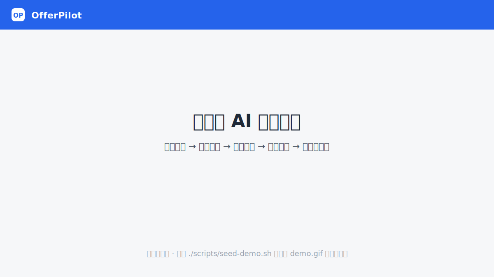
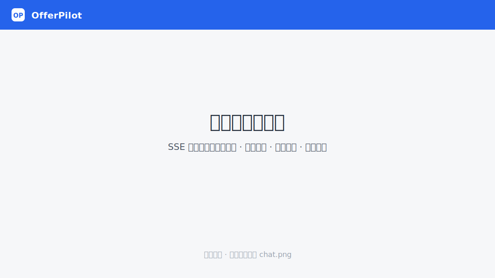
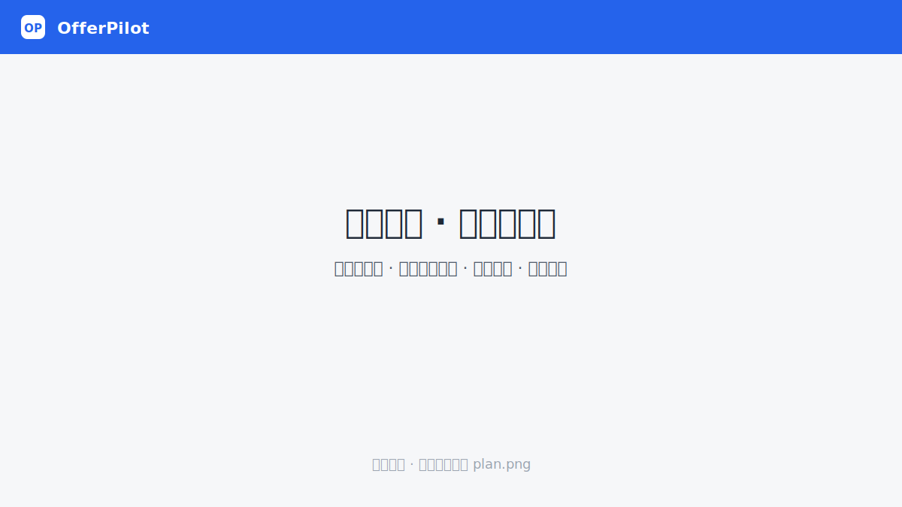
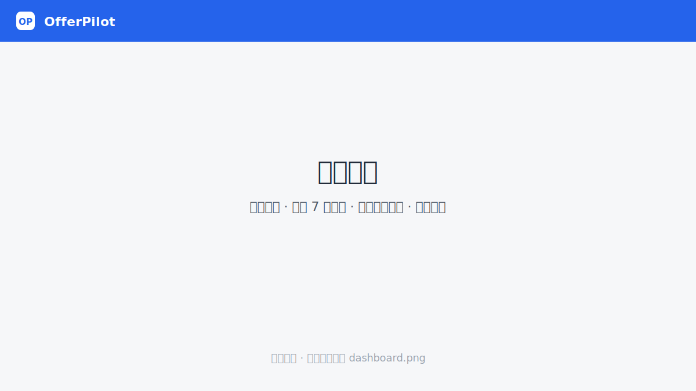

# OfferPilot

> 面向应届生与实习求职者的 **对话式 AI 求职规划 Agent**：从简历与岗位 JD 出发，
> 流式分析技能缺口、优化项目表达，生成可执行的学习/面试路线，并把它落成
> **每天能勾选的任务 + 会随进度自动重排的执行闭环**。



<sub>上图为占位图。`./scripts/seed-demo.sh` 可一键播种演示数据，录制方法见 [docs/assets](docs/assets/README.md)。</sub>

[](LICENSE)


---

## 这是什么

很多求职工具止步于「给一份分析报告」。OfferPilot 想多走两步：把一次性的分析变成
**有状态、会陪跑的求职旅程**——

1. **看清差距**：对话里上传简历、粘贴 JD、说明方向，AI **流式**地一边做一边展示
   （可联网检索该岗位当前常见技能），产出可解释的结构化报告（匹配度 / 技能缺口含来源 /
   简历优化 / 分周学习与面试路线）。
2. **能执行**：学习路线不是一段读完即弃的文字——它被**物化成排到「天」的可勾选任务**，
   配每日打卡。
3. **会自适应**：当你完成得快或慢、有任务逾期，系统**动态再规划**——顺延逾期、按每日容量
   重组日程、对反复拖延的任务降权——而不是把计划推倒重来。
4. **有温度**：一根**语气滑块**让 AI 从「温柔鼓励」滑到「严格鞭策」，措辞可调但底线不变
   （永远基于事实、不编造、不报具体「Offer 概率」）。

> **项目定位**：这是一个开源作品集项目，目标是把上面这条「分析 → 执行 → 自适应」的
> 完整闭环做扎实、可演示、有工程深度——而非一个商业产品。

---

## 三个技术亮点

### 1. 流式对话 Agent（过程可见、可降级）
后端以 **SSE** 把分析过程逐步推给前端：工具调用（联网搜索 / 运行分析）与 AI 解读实时呈现，
告别「黑屏等待」。底层是可控的两步工作流（先 `analyze_match` 出匹配报告，再 `generate_plan`
出学习方案），而非放任模型自由发挥。
**可离线、可降级**：未配置 LLM 时自动用规则引擎跑通整条闭环；未配置搜索时仅凭已有知识作答。
→ `backend/app/services/agent.py`、`backend/app/routers/chat.py`

### 2. 有状态执行闭环（roadmap → 可勾选任务 → 打卡 → 进度）
学习路线经一份**幂等物化契约**拆成 `Task` 行（按 `(run, week, order_index)` 业务键
merge-upsert，保留用户已完成进度，roadmap 删项软删而非物删，保证打卡引用永不悬空）。
任务可勾选、可打卡，进度（完成率 / 连续打卡 streak / 各周完成度 / 最近 7 天热力）实时聚合，
**无需后台定时任务**。
→ `backend/app/services/materialize.py`、`backend/app/routers/{tasks,checkins,progress}.py`、
`frontend/src/components/ProgressBoard.vue`

### 3. 动态再规划算法（工程故事的核心）
打卡或手动「结算」会触发再规划——**非从零重生成**，而是只对未完成任务做三件事：

- **顺延**：`planned_date` 早于今天且未完成的任务，滚动到今天起的剩余日程；
- **重组**：所有未完成任务按 `(week, order_index)` 序，以**每日容量上限**均匀摊到
  `[今天 .. 计划末日]`，避免逾期任务堆成一坨；
- **降权**（仅每日结算）：仍逾期未完成的任务 `weight−1`（下限 0）作「持续被拖延」的至危信号，
  供前端弱化展示与后续状态机消费。

结果写入 `JourneyState.signals`，前端进度看板据此给出**节奏洞察**。算法对「同一天重复结算」
天然幂等（逾期任务已被移到 ≥ 今天，二次结算无可降权项）。
→ `backend/app/services/replan.py`、`backend/app/routers/journey.py`

> 加分项 ①：**碰壁期闭环**——面经复盘 → 盲区提取（LLM 抽取 / 规则 `match_skills`，统一归一到
> 技能本体；命中已知缺口的盲区升级严重度）→ 权重回灌（命中盲区的未完成任务提 `weight` 并提到今天，
> 前端标「🎯 重点」）。把「面试受挫」转成「下一轮学习的优先级」。
> → `backend/app/services/interview.py`、`backend/app/routers/interviews.py`
>
> 加分项 ②：**人设引擎**（理智脑/情感脑解耦）——单一人设 + 语气强度滑块，只调系统提示的措辞，
> 不动分析逻辑与工作流。→ `backend/app/services/agent.py`（`_tone_directive`）

---

## 截图

| 对话式流式分析 | 执行计划 · 动态再规划 | 我的进度看板 |
|---|---|---|
|  |  |  |

---

## 快速开始

前置：Python 3.10+；Node 18+（仓库已在 `.tooling/` 内置本地 Node 24，脚本会自动优先使用）。

```bash
# 终端 1：后端（首次会自动建虚拟环境并装依赖）
./scripts/dev-backend.sh            # 默认 http://localhost:7968

# 终端 2：前端（首次会自动 npm install）
./scripts/dev-frontend.sh           # http://localhost:5173

# 终端 3（可选）：播种一份「活」的演示数据，便于体验/录制
./scripts/seed-demo.sh              # 输出会打印可访问的 /plan/<id>
```

打开 http://localhost:5173 ，在对话框粘贴简历与若干 JD、补充目标方向，AI 会流式产出报告与学习方案；
点报告里的入口进入 **执行计划**（`/plan/:runId`）勾选任务、每日打卡，并在 **我的进度**
（`/dashboard`）查看完成率与坚持天数。

> 端口可覆盖：`PORT=8010 ./scripts/dev-backend.sh`，同时
> `VITE_API_TARGET=http://localhost:8010 ./scripts/dev-frontend.sh`。

### 启用 LLM（可选）
复制 `backend/.env.example` 为 `backend/.env`，把 `LLM_PROVIDER` 设为 `openai` 或 `anthropic`
（指 **API 协议**，不绑定厂商）。配合 `OPENAI_BASE_URL` / `ANTHROPIC_BASE_URL` 可对接任意兼容服务
（DeepSeek、OpenRouter、本地 vLLM/Ollama 等，需同时设 `LLM_MODEL`），并把对应 SDK 装进 venv：
`pip install openai`（或 `anthropic`）。详见 `backend/.env.example`。

### 启用联网搜索（可选）
在 `backend/.env` 设 `TAVILY_API_KEY`，让 Agent 能检索较新岗位的常见技能。
后端走你环境里现有的 HTTP 代理出网，**不会修改任何代理环境变量**。

---

## 架构概览

```
                 ┌──────────────────────────── 前端 (Vue 3 + TS) ─────────────────────────┐
   浏览器 ──────▶ │  对话(/)  执行计划(/plan)  我的进度(/dashboard)  历史(/history)        │
                 │  api/client.ts 统一注入 X-Device-Id（多租户接缝）                       │
                 └───────────────┬────────────────────────────────┬───────────────────────┘
                          SSE 流  │                          REST   │
                 ┌───────────────▼────────────────────────────────▼───────────────────────┐
                 │                         后端 (FastAPI)                                    │
                 │  chat.py ──▶ agent.py ─┐                                                  │
                 │                        ├─▶ pipeline.py: 简历/JD 解析 → 技能归一化         │
                 │  analysis.py ──────────┘      → 缺口分析 → 优化建议 → 路线生成            │
                 │                                       │ result.roadmap                    │
                 │  闭环服务：ensure_journey → materialize(幂等) → replan(顺延/重组/降权)    │
                 │  tasks / checkins / journey / progress 路由（实时聚合，无定时任务）       │
                 └───────────────────────────────────┬──────────────────────────────────────┘
                                              SQLite / PostgreSQL（9 表）
```

**里程碑一地基（薄切多租户接缝 + 守门）**：所有闭环表 day-one 带 `user_id String(64)`，
经 `deps.get_current_user`（读 `X-Device-Id`，默认 `local`）解析；`ownership.py` 收口归属校验
（本期单点放行、留 M3 接口）；`db_guard.verify_schema` 启动时对照声明表与实际表，缺失仅告警不阻断
（MVP 不引入迁移工具，`backend/migrations/` 仅存非执行蓝图）。

---

## 核心 API

| 方法 | 路径 | 说明 |
|---|---|---|
| POST | `/api/chat/stream` | **对话式 Agent（SSE 流式）**：流式输出 + 工具调用 + 报告 |
| POST | `/api/analysis/run` | 运行一次完整分析（结构化，对话 Agent 内部也复用它） |
| GET | `/api/analysis` · `/api/analysis/{id}` | 历史列表 / 单次完整结果 |
| POST | `/api/resumes/parse` · `/api/resumes/upload` | 粘贴文本 / 上传 PDF 解析简历 |
| POST | `/api/jobs/import` | 批量导入 JD |
| GET | `/api/skills/graph` | 技能本体图谱 |
| GET · POST · PUT · DELETE | `/api/saved-jds` | 可复用 JD 库（增查改删） |
| GET · POST · GET | `/api/conversations` | 会话列表 / 保存 / 单条详情（续聊） |
| GET | `/api/tasks` · PATCH `/api/tasks/{id}` | 任务列表 / 勾选改状态（闭环核心） |
| POST · GET | `/api/checkins` | 每日打卡 upsert / 列表（打卡触发自动结算重排） |
| GET · PATCH | `/api/journey` · `/api/journey/{id}` | 旅程读取 / 更新 |
| POST | `/api/journey/{id}/replan` | **动态再规划**（顺延/重组/降权） |
| GET | `/api/progress` | 进度聚合（完成率 / streak / 周进度 / 最近 7 天热力） |
| POST · GET | `/api/interviews` | **面经复盘 → 盲区提取 → 权重回灌**（碰壁期闭环） |
| GET | `/api/health` | 健康检查（含当前解析引擎） |

启动后端后，交互式文档见 http://localhost:7968/docs 。

---

## 数据模型（9 表 · SQLite 默认）

| 表 | 作用 |
|---|---|
| `resumes` / `job_postings` / `analysis_runs` | 简历 / JD / 一次完整分析（结构化结果以 JSON 存） |
| `conversations` / `saved_jds` | 对话历史（含报告块，可续聊）/ 可复用 JD 库 |
| `journey_states` | 旅程主表：阶段 / 多终态 status / 多维 signals / persona+tone / 计划周数 |
| `tasks` | roadmap 物化的可勾选任务：四态 status、weight、`planned_date`、`order_index` |
| `check_ins` | 每日打卡：`(user_id, date)` 唯一、upsert、引用 `Task.id` 稳定主键 |
| `interview_logs` | 面经复盘：复盘原文 + 提取出的盲区（用于权重回灌） |

闭环表（`journey_states` / `tasks` / `check_ins` / `interview_logs`）均 day-one 带 `user_id`，与未来真实账号同形。

---

## 测试

```bash
cd backend && .venv/bin/python -m pytest -q     # 规则模式离线端到端 + 闭环/再规划/人设/面经回灌，92 passed
cd frontend && npm run build                      # vue-tsc 类型检查 + vite 构建
```

后端测试默认在**规则模式**下跑（不依赖外部 LLM/网络），覆盖物化幂等契约、只读聚合、写入闭环、
动态再规划、人设语气、schema 守门等。

---

## 路线图

- ✅ **里程碑一 · 有状态闭环地基**：多租户接缝 + 守门、三张状态表、幂等物化契约、读写 API、前端接入。
- ✅ **里程碑二 · 注入灵魂**：动态再规划引擎（任务排到天 + 顺延/重组/降权 + 打卡自动结算）、
  人设引擎（语气滑块）、进度可视化（完成率环 / 7 天热力 / 阶段步骤条 / 节奏洞察）。
- ✅ **碰壁期闭环（F1）**：面经复盘 → 盲区提取（LLM/规则归一到技能本体）→ 权重回灌
  （命中盲区的未完成任务提权并提到今天，前端标「🎯 重点」；计划未覆盖的盲区建议加练）。
- ⏭️ **下一步**：旅程状态机（按多维信号判定阶段并触发干预）、
  真实环境感知（浏览器扩展抓当前 JD / 复用现成爬虫，放后期、默认关）。

详见 [docs/行动计划.md](docs/行动计划.md)。

---

## 目标用户

- 应届生；想找实习的大二/大三/大四在校生；
- 有课程项目、个人项目或比赛经历，但不知道如何匹配岗位要求的学生。

## 技术栈

- **前端**：Vue 3 + Vite + TypeScript（无重型状态库，`shared/` 轻量响应式单例）
- **后端**：FastAPI + SQLAlchemy 2.0（Mapped 声明式）
- **数据库**：SQLite（MVP 默认，零配置）/ PostgreSQL（`DATABASE_URL` 切换）
- **工作流**：轻量可控两步 Agent 工作流（后续可考虑 LangGraph）
- **LLM**：OpenAI / Anthropic 兼容协议（对话 Agent 需 function calling；可选，缺省走规则）
- **联网搜索**：Tavily（可选，缺省不联网）
- **对话**：SSE 流式 + 可控工具调用（`web_search` / `analyze_match` / `generate_plan`）

## 文档

- [行动计划与路线图](docs/行动计划.md)
- [项目整理](docs/AI求职Agent项目（OfferPilot）整理.md)
- [PRD 与技术方案草案](docs/OfferPilot_PRD_技术方案草案.md)
- [MVP 实现说明 v0.1](docs/实现说明_v0.1.md)
- [修改日志](docs/修改日志/)

## License

[AGPL-3.0](LICENSE)
