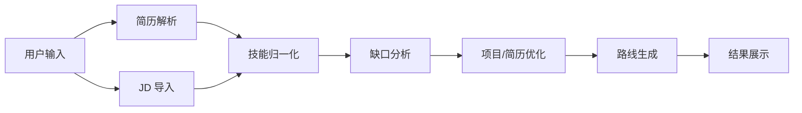

# OfferPilot PRD 与技术方案草案 v0.1

## 0. 一页结论

OfferPilot 的核心不是“帮用户学更多东西”，而是“围绕目标岗位，把简历、JD 和学习/面试准备串成一个可执行闭环”。

第一版建议只做一个最小闭环：

- 输入：1 份学生简历或项目经历 + 3~10 个实习/校招目标 JD
- 输出：岗位画像、技能缺口、项目/简历优化建议、4 周学习/面试路线、可导出的结果页
- 形态：Web App
- 技术路线：先用 Workflow 做稳定闭环，再逐步引入 Agent 编排

建议首发先聚焦一个垂直方向，例如前端实习、Java 后端实习或前端校招岗位，先把学生求职场景里的岗位画像、项目表达和补强路线打磨稳，再扩展到更多岗位。

---

## 1. 产品定位

### 1.1 产品一句话

OfferPilot 是一个面向应届生和实习求职者的 AI 求职规划工具，输入学生简历、项目经历和目标岗位后，自动分析岗位要求、识别技能缺口，并生成可执行的简历优化、学习补强与面试准备路线。

### 1.2 核心价值

- 帮用户快速知道“投这个实习/校招岗位差什么”
- 帮用户判断“先补什么”
- 帮用户把“学习计划”和“项目包装”变成“拿实习/校招 Offer 的计划”

### 1.3 不是做什么

- 不是泛聊天机器人
- 不是纯课程推荐器
- 不是自动投递系统
- 不是单纯的 Prompt/Skill 展示页

---

## 2. 目标用户

### 2.1 主目标用户

- 应届生
- 想找实习的大二、大三、大四在校生
- 有课程项目、个人项目或比赛经历，但不知道如何匹配岗位要求的学生

### 2.2 次级用户

- 0~1 年经验的初级求职者
- 转行到技术岗位的人
- 想系统整理自身能力的人

### 2.3 典型场景

- 想投实习/校招岗位，但不知道自己的简历能投哪些方向
- 有一些课程项目或个人项目，但不知道如何写成岗位相关经历
- 看了很多 JD，却不知道哪些技能必须先补
- 距离暑期实习、秋招、春招或面试只有 2~8 周，需要快速补强
- 想判断自己适合前端、后端、算法、测试、产品等哪个方向

---

## 3. 核心问题

用户在求职过程中通常会遇到这几个问题：

- 学生简历、项目经历和 JD 之间没有系统对齐
- 技能项太多，无法判断优先级
- 学习内容很多，但缺少面向投递和面试的时间安排
- 面试准备缺少针对性
- 不清楚自己是“缺技能”“缺项目”还是“缺表达”

OfferPilot 要解决的不是“知识获取”本身，而是“实习/校招目标导向的能力补齐、项目表达和面试准备”。

---

## 4. MVP 范围

### 4.1 必做功能

| 模块 | 说明 |
|---|---|
| 简历上传/粘贴 | 先支持 PDF，也允许粘贴项目经历和教育背景 |
| JD 输入 | 先支持手动粘贴或文本导入 |
| 岗位画像 | 抽取职责、技能、学历/年级要求、项目偏好和优先项 |
| 技能缺口分析 | 对比简历/项目与 JD，输出缺口和优势 |
| 简历/项目优化建议 | 指出哪些经历应该强化、补证据或重写表达 |
| 学习路线生成 | 按周拆分，给出可执行任务和面试准备重点 |
| 结果导出 | 支持复制、下载或保存历史记录 |

### 4.2 暂缓功能

| 模块 | 原因 |
|---|---|
| 自动全网抓取 JD | 合规和稳定性成本较高 |
| 面试模拟器 | 范围会迅速变大 |
| 自动投递 | 不属于当前闭环核心 |
| 大规模学习资源推荐 | 需要额外内容治理 |

### 4.3 建议的输入规模

原始构想里写的是 50~100 个 JD。这个方向没问题，但更适合第二阶段。

第一版更建议：

- 3~10 个 JD 做对比分析
- 先把单个岗位画像做准
- 再做多 JD 聚合和趋势归纳

这样能显著降低采集、清洗和提示词调优成本。

---

## 5. 用户流程

1. 用户创建一个实习/校招求职项目
2. 上传简历，或粘贴教育背景、项目经历和技能栈
3. 输入目标岗位名称，例如前端实习、Java 后端实习、算法实习
4. 导入 3~10 个 JD
5. 系统生成岗位画像
6. 系统输出技能缺口与已有优势
7. 系统生成 2~8 周学习/面试路线
8. 用户查看结果并保存

### 5.1 结果页应该回答的核心问题

- 这个岗位到底在要什么
- 我已经具备什么
- 我最缺什么
- 我的项目/简历应该怎么改
- 先补什么最划算
- 接下来每周应该做什么

---

## 6. 输出定义

### 6.1 核心输出

- 匹配度总览
- 必备技能缺口
- 加分技能缺口
- 已具备技能
- 岗位职责画像
- 简历/项目表达优化建议
- 学习路线
- 面试准备建议

### 6.2 结果解释要求

每个结论都要尽量带来源说明，例如：

- 这项技能来自哪几份 JD
- 简历里哪段经历支持了该技能
- 为什么它被判定为“缺失”或“薄弱”

这样用户才会信任结果，而不是把它当作一段“看起来很聪明”的文本。

---

## 7. 核心能力拆解

### 7.1 简历解析

目标是把非结构化简历转成结构化数据。

建议提取：

- 基本信息
- 教育背景
- 实习经历
- 项目经历
- 课程/比赛/开源经历
- 技能列表
- 证据片段

### 7.2 JD 解析

目标是把 JD 拆成可比较的结构。

建议提取：

- 职位名称
- 责任描述
- 必备技能
- 加分技能
- 学历/年级要求
- 实习周期或到岗时间要求
- 技术栈
- 业务背景

### 7.3 技能归一化

同一个能力在不同 JD 里可能会写成不同词：

- TypeScript / TS
- React / Hooks / 前端框架
- Docker / 容器化

因此需要一层技能本体或别名表，把同义词统一到一个节点上。

### 7.4 技能缺口分析

建议按以下维度输出：

- 是否具备
- 证据强度
- 缺口程度
- 优先级
- 是否影响面试通过
- 是否能通过现有项目经历补足表达

### 7.5 路线生成

路线不是简单列书单，而是要回答：

- 每周学什么
- 每周做什么练习
- 简历或项目描述每周怎么优化
- 产出什么可验证结果
- 如何知道自己学会了

---

## 8. 技能图谱草案

技能图谱建议先做树状结构，再逐步升级成图谱。

```text
前端
├── HTML
├── CSS
├── JavaScript
│   ├── ES6
│   ├── 事件循环
│   └── 闭包
├── TypeScript
├── Vue
│   ├── 响应式
│   ├── Router
│   └── 状态管理
└── 工程化
    ├── Vite
    ├── Docker
    └── 构建与部署
```

### 8.1 熟练度建议

- 了解：知道概念
- 熟悉：能在项目中使用
- 掌握：理解原理并能排障
- 精通：能优化方案并解决复杂问题

---

## 9. 技术架构

### 9.1 推荐架构



### 9.2 技术选型建议

- 前端：Next.js + React
- 后端：FastAPI
- 工作流：先用轻量编排，后续再接 LangGraph
- 数据库：PostgreSQL
- 向量库：可选，MVP 不强依赖
- 爬虫：Playwright，后续按需启用
- 模型：OpenAI / Claude 二选一或双模型策略

### 9.3 选型原则

- 能用结构化规则解决的，不要先上复杂 Agent
- 能靠人工输入稳定拿到的，不要先做自动爬虫
- 能放到数据库里的，不要一开始就依赖向量检索

这会让第一版更稳，也更容易调试。

---

## 10. Agent / Workflow 拆分

### 10.1 第一阶段建议

先把它当成一个可控的工作流，而不是多个“自由行动”的 Agent。

建议节点：

1. 简历解析节点
2. JD 解析节点
3. 技能归一化节点
4. 缺口分析节点
5. 项目/简历优化节点
6. 路线生成节点
7. 结果整理节点

### 10.2 第二阶段再做的事

- 引入 LangGraph 编排
- 把各节点拆成可复用 Agent
- 加入历史上下文与多轮迭代
- 支持用户反复调整目标岗位后重新分析

### 10.3 为什么不一开始就全 Agent 化

因为这类项目最难的通常不是“会不会调用模型”，而是：

- 输入是否干净
- 结果是否稳定
- 解释是否可信
- 输出是否可执行

先把流程跑顺，再谈自治，会更省时间。

---

## 11. 数据模型草案

### 11.1 核心实体

- Resume
- ProjectExperience
- JobPosting
- AnalysisRun
- SkillNode
- SkillAlias
- RoadmapItem
- EvidenceSpan
- Resource

### 11.2 关键字段建议

Resume：

- id
- raw_text
- structured_json
- source_type
- created_at

ProjectExperience：

- id
- resume_id
- title
- raw_description
- tech_stack
- role
- evidence_points

JobPosting：

- id
- title
- company
- raw_text
- structured_json
- source_url
- job_type

AnalysisRun：

- id
- resume_id
- job_ids
- match_score
- summary
- model_version
- created_at

RoadmapItem：

- week_index
- focus_skills
- tasks
- deliverables
- estimated_hours

---

## 12. 接口草案

### 12.1 建议的 API

- `POST /api/resumes/parse`
- `POST /api/jobs/import`
- `POST /api/analysis/run`
- `GET /api/analysis/{id}`
- `POST /api/roadmap/generate`
- `GET /api/skills/graph`

### 12.2 接口设计原则

- 输入尽量结构化
- 输出尽量可解释
- 所有分析结果保留版本号
- 允许用户重新运行分析

---

## 13. 评估标准

### 13.1 功能验收

- 能正确识别简历中的主要技能和项目
- 能从 JD 中提取出岗位要求
- 能给出有依据的缺口判断
- 能生成按周拆分的路线

### 13.2 质量验收

- 结果是否具体，而不是空话
- 结果是否能解释为什么这么判
- 路线是否真的能执行
- 用户是否能据此继续准备面试

### 13.3 建议的小样本评测

先找 20~30 份真实简历和 30~50 个真实 JD 做人工评测，看：

- 提取准确度
- 缺口判断是否合理
- 路线是否可执行
- 结果是否足够像“求职助手”

---

## 14. 风险与待决策项

### 14.1 主要风险

- JD 文本噪声大，格式不统一
- 简历写法差异大，解析容易丢信息
- 技能本体维护成本高
- 模型输出容易泛化成空话
- 爬虫带来稳定性和合规风险

### 14.2 当前需要尽快定下来的事

- 首发聚焦哪个岗位方向
- 是否允许用户手动粘贴 JD 作为唯一输入
- 简历是否只支持 PDF
- 是否需要保存历史记录
- 是否在第一版就做学习资源推荐

---

## 15. 迭代路线

### Phase 0：定义标准

- 确定目标用户
- 确定首发实习/校招岗位
- 确定技能本体 v0.1
- 准备样本数据

### Phase 1：单次分析闭环

- 简历解析
- JD 导入
- 技能缺口分析
- 简历/项目表达优化
- 学习路线生成
- 结果页展示

### Phase 2：多 JD 与历史记录

- 支持多个 JD 聚合
- 支持历史对比
- 支持重复运行和版本管理

### Phase 3：CLI / MCP

- CLI 用于开发者和高级用户
- MCP 用于开放能力接口

### Phase 4：Skill 资产沉淀

- 把稳定的提示词、规则和模板沉淀成可复用资产

---

## 16. 下一步建议

如果要继续往下推进，优先做这三件事：

1. 锁定首发岗位范围
2. 定义技能本体和实习/校招样本 JD
3. 画出第一版页面和结果页结构

这三件事完成后，就可以直接进入实现。
